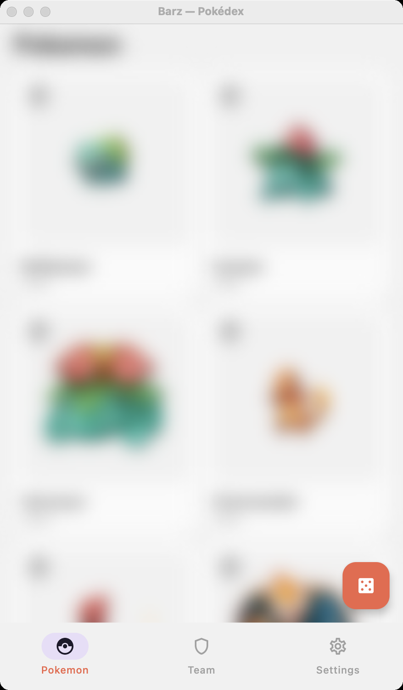
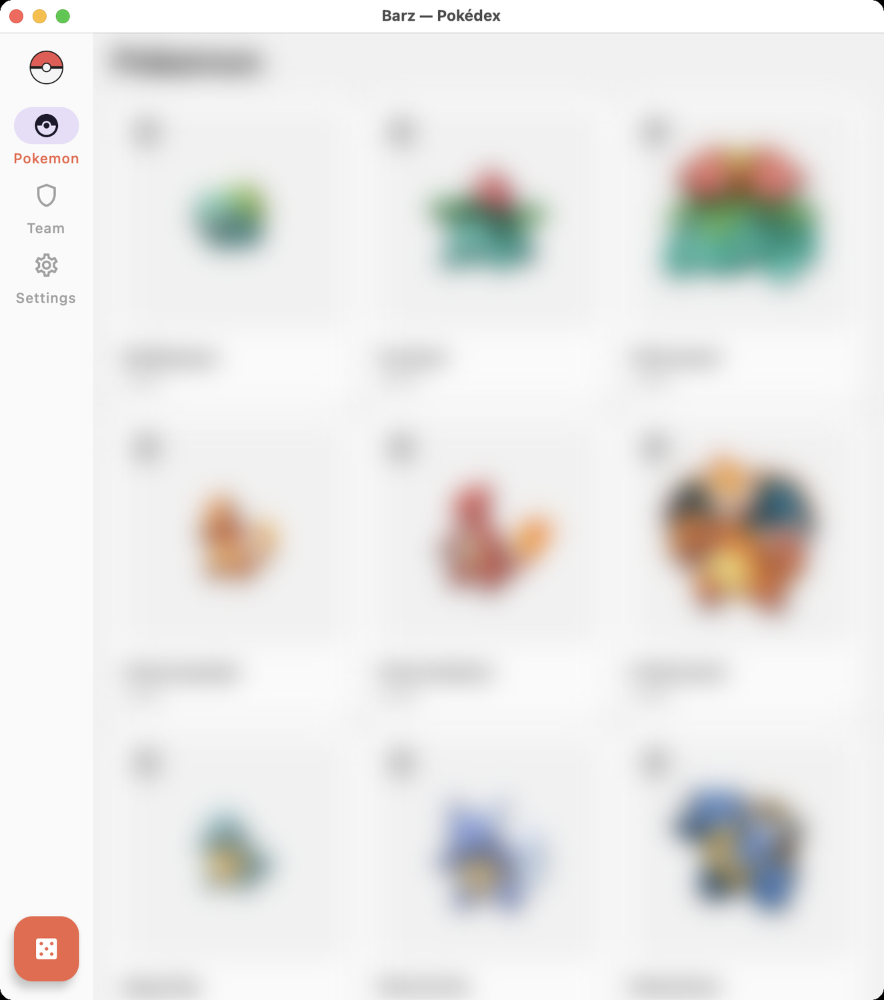
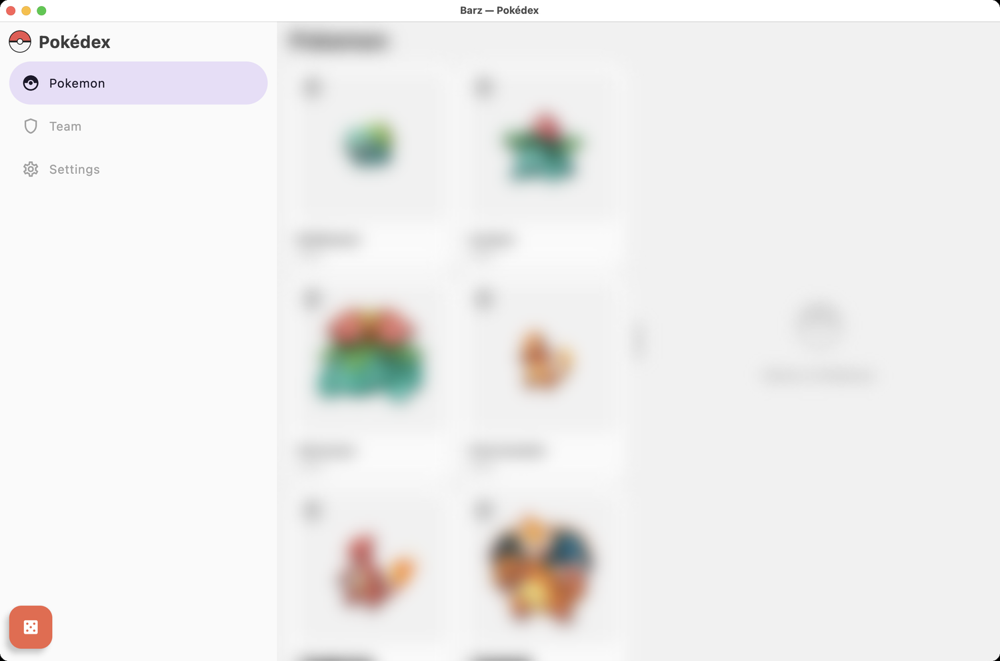
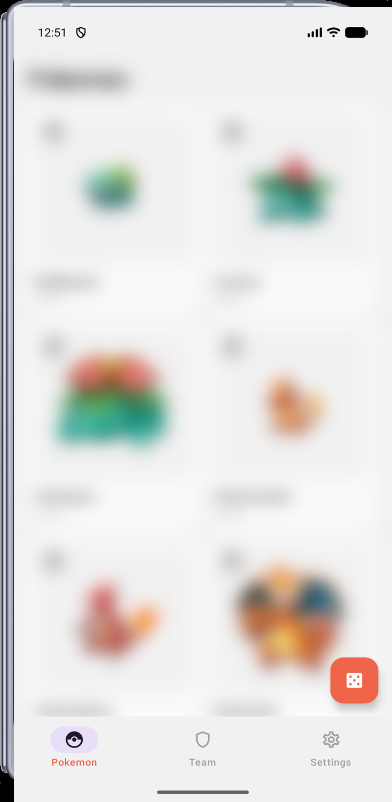
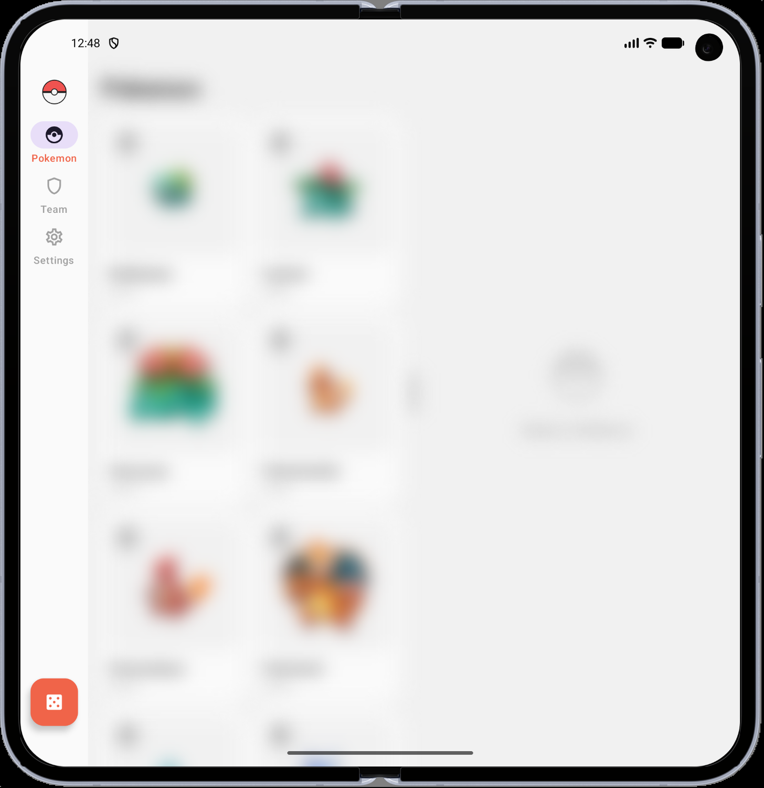
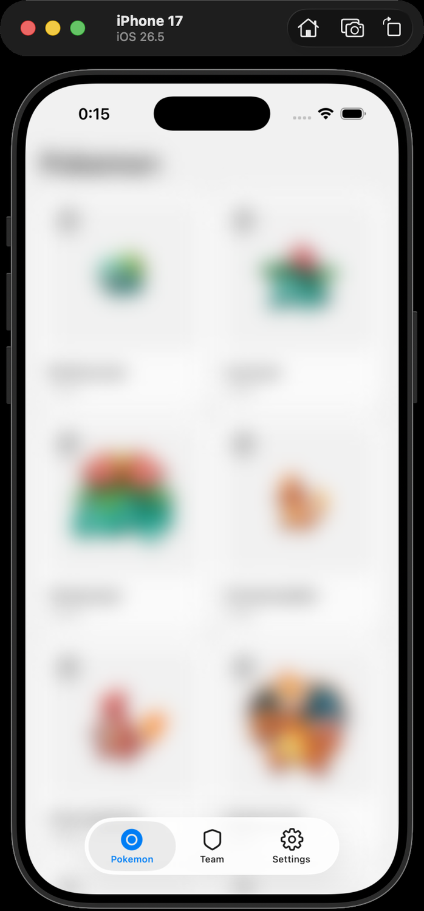
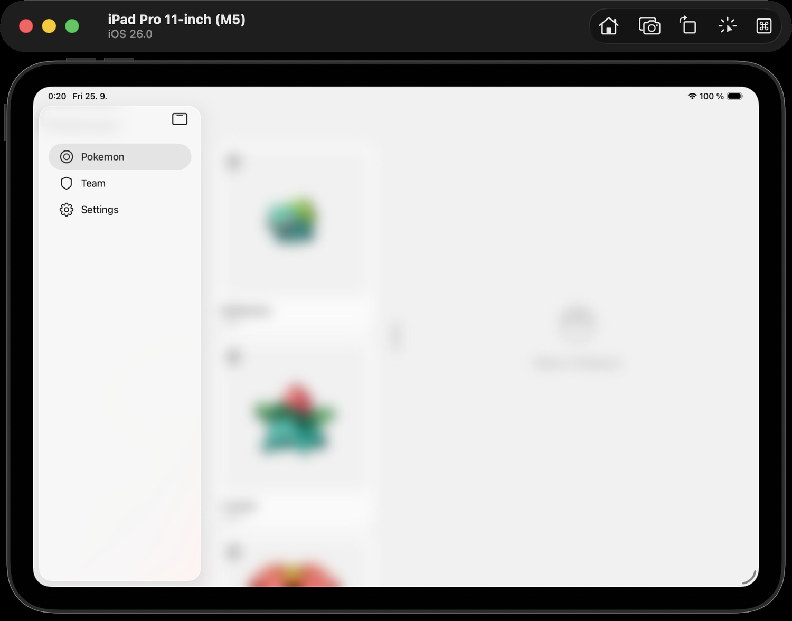
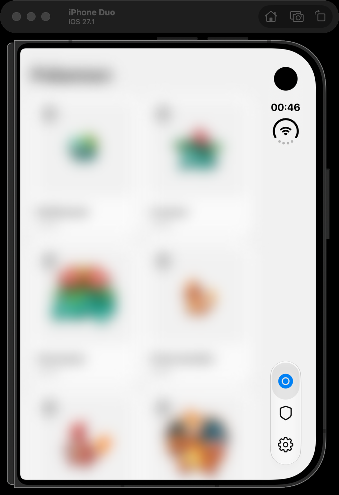
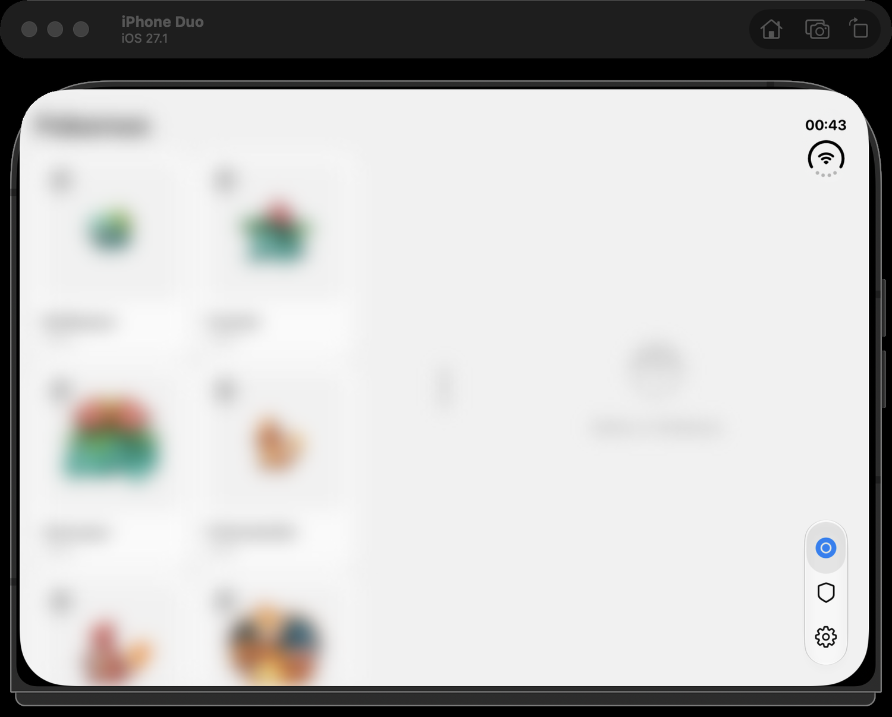
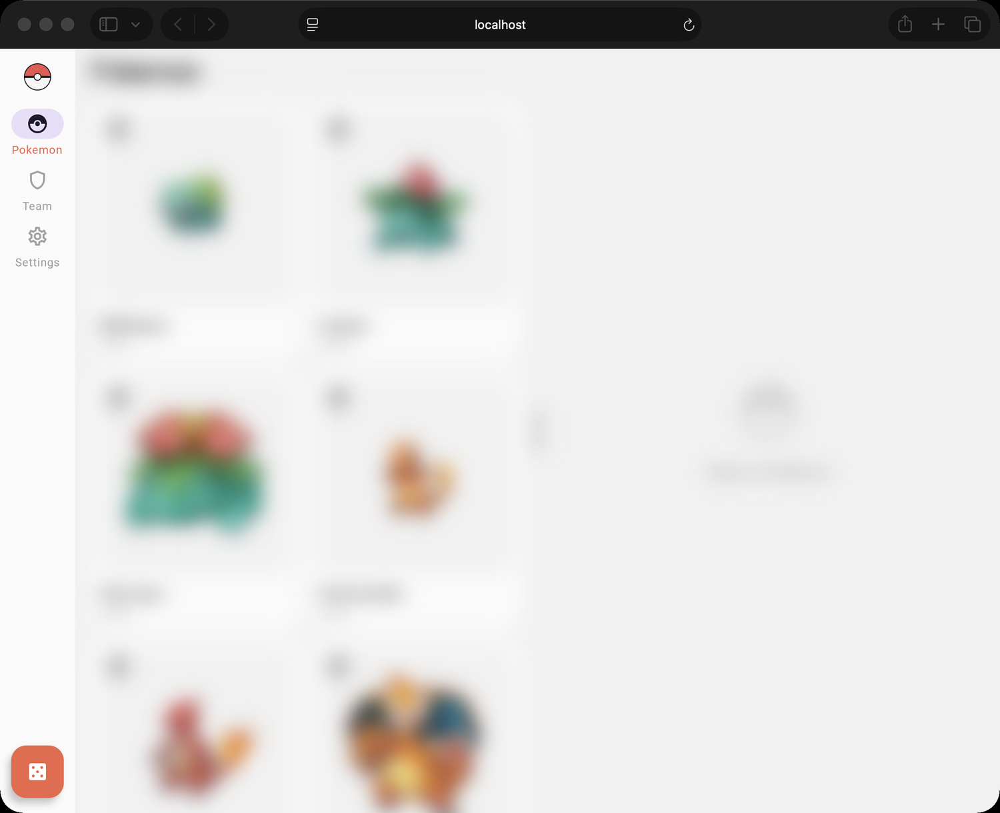

# Barz

Adaptive navigation chrome for Compose Multiplatform. One list of destinations; a bottom bar, a
navigation rail or a permanent drawer depending on the window — and a real `UITabBarController` on
iOS rather than an imitation of one.

```kotlin
implementation("dev.parez.barz:barz:0.1.0-SNAPSHOT")
```

| Target | Chrome |
|---|---|
| Android | Material 3 bar / rail / drawer |
| Desktop (JVM) | same, tracking the window as you resize it |
| Web (Wasm, JS) | same, tracking the browser viewport |
| iOS | real `UITabBarController` built from Kotlin/UIKit, or a Compose-drawn bar |

## What it looks like

One `AdaptiveNavigationScaffold`, one list of destinations. Everything below is the same sample app
on the same code path — only the window changed.

### The three modes

| Bottom bar | Rail | Drawer |
|---|---|---|
| under 600dp | 600dp and up | 1200dp and up |
|  |  |  |

### Foldables

Barz holds the drawer back until **1200dp**, not Material's 840dp "expanded". An unfolded Pixel 10
Pro Fold is 852dp wide — under Material's default that earns a permanent drawer eating ~40% of the
screen; under Barz it gets a rail, and the content keeps its two panes.

| Folded — 443dp, bottom bar | Unfolded — 852dp, rail |
|---|---|
|  |  |

### iOS, natively

`barzTabBarController` builds a real `UITabBarController`, so the system — not Barz — decides where
the bar goes. On iPhone it is a Liquid Glass tab bar; on iPad it adapts to a sidebar; on iPhone Duo
it relocates to the side strip by itself, in both postures.

| iPhone | iPad — sidebar | iPhone Duo, folded | iPhone Duo, open |
|---|---|---|---|
|  |  |  |  |

### Web



> The sample deliberately frosts its own screens so the navigation chrome is the only thing in
> focus. That blur is the demo's, not the SDK's — see [the sample](#the-sample).

## Quick start

```kotlin
import androidx.compose.material.icons.Icons
import androidx.compose.material.icons.filled.Home
import androidx.compose.material.icons.filled.Person
import androidx.compose.material3.Icon
import androidx.compose.runtime.Composable
import androidx.compose.runtime.getValue
import androidx.compose.runtime.mutableIntStateOf
import androidx.compose.runtime.saveable.rememberSaveable
import androidx.compose.runtime.setValue
import dev.parez.barz.AdaptiveNavigationScaffold
import dev.parez.barz.NavigationItem

private val items = listOf(
    NavigationItem(title = "Home", systemIcon = "house"),
    NavigationItem(title = "Profile", systemIcon = "person", badge = "3"),
)

@Composable
fun App() {
    var selected by rememberSaveable { mutableIntStateOf(0) }
    AdaptiveNavigationScaffold(
        items = items,
        selectedIndex = selected,
        onItemSelected = { selected = it },
        icon = { index, _ ->
            Icon(if (index == 0) Icons.Filled.Home else Icons.Filled.Person, null)
        },
    ) {
        Screen(selected)
    }
}
```

`systemIcon` is an SF Symbol name used by the iOS chrome; the `icon` slot draws everything else.
Note it is a **required** parameter that sits after two defaulted ones, so name your arguments.

## Documentation

- **[Integration guide](docs/integration.md)** — install, the four entry points, icons,
  breakpoints, per-platform configuration, the `header` and `fab` slots.
- **[iOS guide](docs/ios.md)** — native chrome, what Liquid Glass actually is and is not, iPad
  sidebar, iPhone Duo, wiring into an Xcode project.
- **[API reference](docs/api-reference.md)** — every public declaration, with the limitations.

## The sample

`sample/` is a Pokédex on [PokéAPI](https://pokeapi.co) with three tabs — Pokemon, Team, Settings —
running on all five targets from one `commonMain`. It exercises both adaptive axes at once: Barz
picks the chrome from the window, and *inside* the Pokemon tab a `ListDetailPaneScaffold`
independently splits into two panes.

```sh
./gradlew :sample:androidApp:installDebug
./gradlew :sample:desktopApp:run                          # drag the window across 600dp and 1200dp
./gradlew :sample:webApp:wasmJsBrowserDevelopmentRun
open sample/iosApp/iosApp.xcodeproj
```

## Building this repo

```sh
./gradlew :barz:allTests              # jvm, android host, iOS simulator
./gradlew :barz:checkKotlinAbi        # fails if the public API changed
./gradlew :barz:publishToMavenLocal
```

Web targets are compile-verified rather than tested: Karma needs a local Chrome, and Node cannot
host them either because Compose's web runtime loads Skiko's `.wasm` over XHR. The logic under test
is `commonMain` and is covered by the three runs above.

`iosX64` (the Intel-Mac simulator) is not published. Apple has wound Intel Macs down and several
Compose Multiplatform artifacts have already stopped shipping that variant.

## Licence

Apache 2.0. See [LICENSE](LICENSE).
